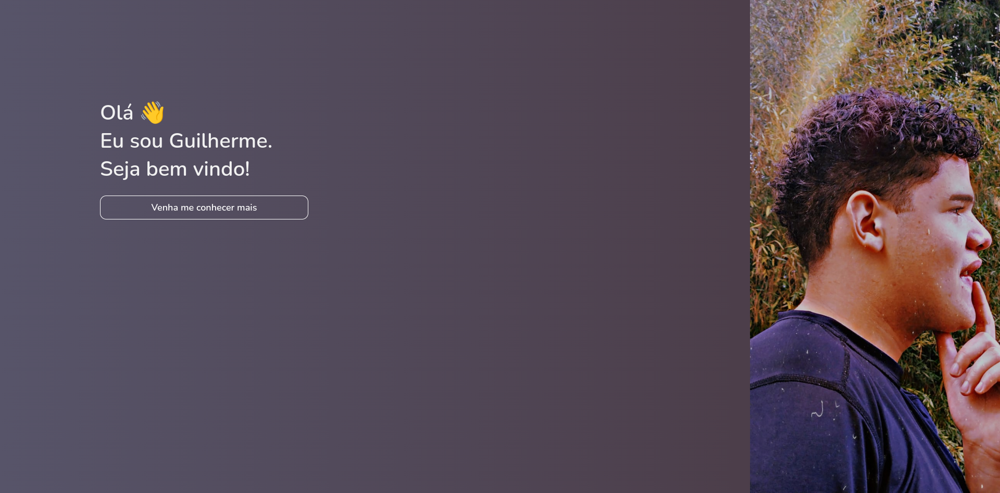

<h1 align="center">
  Gui.Dev.Br
</h1>
<p align="center">


<br>
</p>
<p align="justify" >Meu website pessoal, que inclui blog, mural de projetos, mural de certificações, contato e página de adminstração. Utilizado práticas de SEO, responsividade, Server Side Rendering.</p>

<p align="center">

<a href="https://gui.dev.br"> Veja o site em produção</a>
</p>

<h2>👨‍💻 Tecnologias</h2>
<ul>
<li><b>NodeJS:</b> Utilizado para rodar o servidor backend.</li>
<li><b>Typescript:</b> Utilizado para tipagem estática.</li>
<li><b>NextJS:</b> Utilizado para renderização do lado do servidor.</li>
<li><b>React:</b> Utilizado para criação de componentes.</li>
<li><b>Firebase:</b> Utilizado para autenticação e banco de dados.</li>
</ul>

<h2>🏃 Como rodar</h2>
<p>Para rodar o projeto, você precisa ter o NodeJS instalado em sua máquina. Após isso, basta clonar o repositório e rodar os seguintes comandos:</p>
<p>Não se esqueça de configurar as variáveis de ambiente, que estão no arquivo .env.example.</p>

```bash
# Instalar as dependências
$ yarn
# Rodar o projeto
$ yarn dev
```

<h2>📃 Licença</h2>
<p>Este projeto está sobre a licença MIT. Veja ela em: <a href="LICENSE">LICENSE</a>.</p>
<hr/>
<p align="center">Feito com 🤍 por <a href="https://gui.dev.br">gsbenevides2</a><b>
