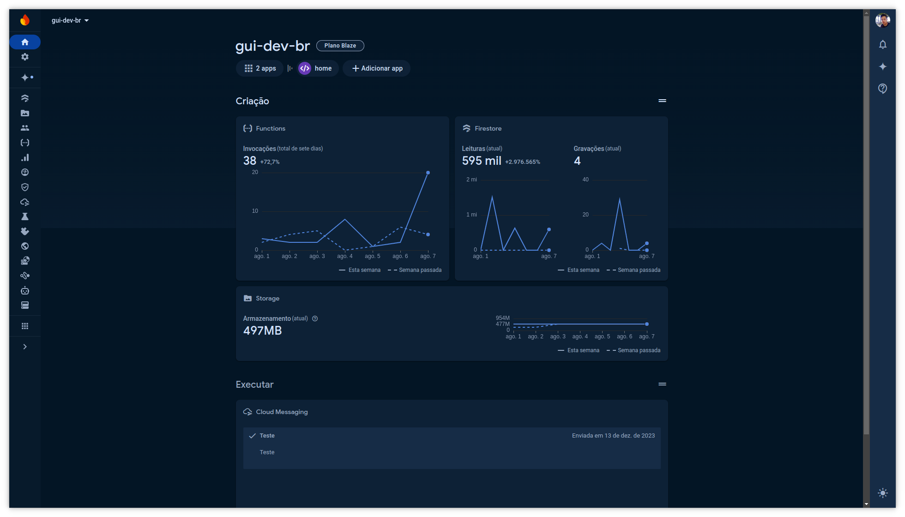

<h1 align="center">
  Firebase - gui.dev.br
</h1>

Nessa branch inclui código de implantação e configuração de projeto firebase

<h2>👨‍💻 Serviços Utilizados::</h2>
<ul>
<li><b>Firebase Cloud Firestore:</b> Banco de dados NoSQL, que guarda texto e informações sobre posts no blog, informações sobre os certificados e projetos, além do sistema de sistema de compartilhamento de arquivos e links curtos.</li>
<li><b>Firebase Authentication:</b> Gestão de usuários e processo de autenticação!</li>
<li><b>Firebase Cloud Functions:</b> Processamento de código do lado do servidor.</li>
<li><b>Firebase Cloud Storage:</b> Armazenamento de arquivos compartilhados, certificados, imagens dos projetos e assets do blog.</li>
</ul>

<h2>🏃 Como rodar</h2>
<h3>Firebase Emulators</h3>

Use o firebase emulators para rodar o projeto localmente. Isso é extremamente útil para testar as funções do firebase, o banco de dados e o armazenamento de arquivos.

<ol>
<li><b>Instale as dependencias usando o yarn:</b> <code>yarn</code></li>
<li><b>Faça o login no firebase rode o commando:</b> <code>yarn setup</code></li>
<li><b>Instale e rode o emulador do firebase:</b> <code>yarn startEmulators</code></li>
</ol>
<h3>Teste as regras de segurança antes de fazer deploy</h3>

Antes de commitar e fazer deploy, teste as regras de segurança do firebase usando o comando (atenção esse commando só funciona com o emulador em execução):

<code>yarn testRules</code>

<h2>📃 Licença</h2>

Este projeto está sobre a licença MIT. Veja ela em: <a href="LICENSE">LICENSE</a>.

Feito com 🤍 por <a href="https://gui.dev.br">gsbenevides2</a><b>
